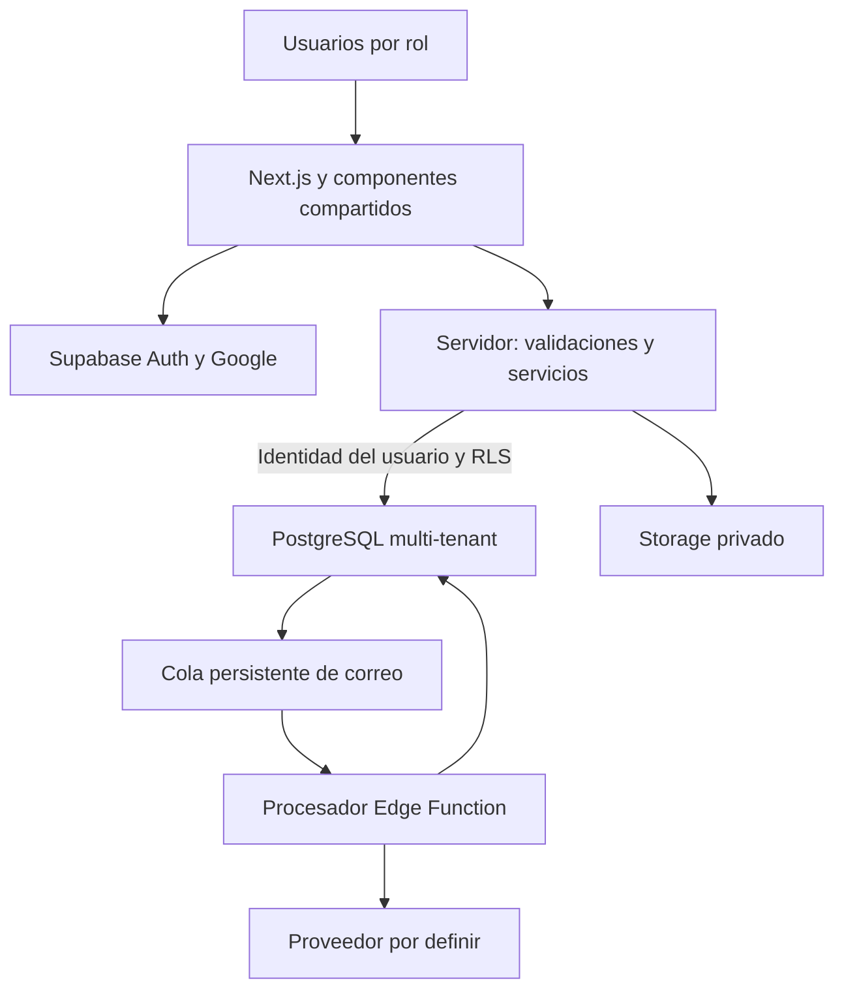

# Etapa 1 — Arquitectura aprobada

Resumen persistente de la propuesta aprobada en la conversación. No describe software implementado.

## Componentes

- Next.js App Router con React y TypeScript: interfaces por rol, servicios por dominio y acceso a datos separado de componentes.
- Tailwind y shadcn/ui: componentes consistentes, diseño sobrio, móvil para residentes y escritorio para administración.
- Supabase Auth: Google OAuth y sesiones compartidas entre navegador y servidor mediante cookies. Identidad no concede membresía.
- PostgreSQL: base compartida, propiedad explícita en datos operativos, RLS, restricciones y transacciones.
- Storage privado: permisos heredados del registro asociado, archivos validados y enlaces temporales según sensibilidad.
- Correo: evento persistido en la transacción del negocio, procesador con reintentos y resultados registrados. Proveedor pendiente.
- Desarrollo, pruebas y producción separados; despliegue Next.js previsto en Vercel. Migraciones versionadas y recuperación de respaldos antes de piloto real.

## Invariantes

1. Propiedad seleccionada en pantalla no es autorización. Verificar membresía activa, permiso y relación con el registro en cada operación.
2. Claves privilegiadas solo para operaciones internas delimitadas. Consultas ordinarias mantienen identidad del usuario y RLS.
3. No mezclar padres e hijos de distintas propiedades. No confiar en UUID difíciles de adivinar.
4. Superadmin gestiona SaaS sin lectura automática de contenido privado. Soporte excepcional requiere alcance, motivo, duración y auditoría; no queda habilitado por defecto.
5. Cambios críticos atómicos: reservas, consumo de invitaciones, registro financiero y eventos pendientes.
6. Revocar membresías afecta nuevas consultas aunque persista una sesión de autenticación.
7. Historial y auditoría no deben revelar secretos ni copiar información sensible innecesariamente.
8. Seguridad, pruebas y responsive acompañan la implementación de cada módulo.

## Organización futura

`src/app`, `src/components`, `src/modules`, `src/lib`, `src/config`, `supabase/migrations`, `tests`, `docs`.

## Criterios de verificación futura

A no puede leer B; residente no consulta PQRS ajena; portería no consulta cartera; invitación vencida/reutilizada falla; revocación bloquea acceso; conflictos simultáneos de reservas se rechazan; fallo de correo no pierde operación; documento privado no se obtiene con su identificador.

## Referencias oficiales consultadas

- [Autorización en Next.js](https://nextjs.org/docs/app/guides/authentication).
- [Supabase Auth en servidor](https://supabase.com/docs/guides/auth/server-side).
- [Seguridad de datos Supabase](https://supabase.com/docs/guides/database/secure-data).

No se fijaron versiones de dependencias; se verificarán al inicializar el proyecto.
