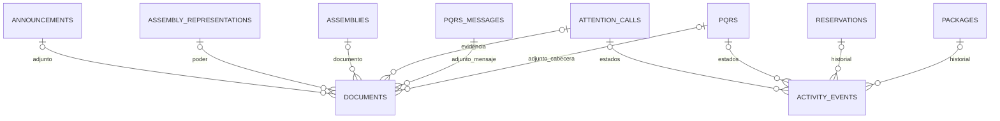

# Etapa 2 — Modelo de datos propuesto

Estado: aprobado por el usuario con «esta perfecto, aprobado. sigamos». No contiene SQL ejecutable ni crea tablas. Las decisiones de negocio P01–P11 de `01-seguimiento.md` siguen abiertas. Fecha: 2026-09-28.

## 1. Objetivo

Definir entidades, atributos, claves, relaciones, índices, restricciones y necesidades de acceso para todas las funciones solicitadas. Implementar cada tabla únicamente cuando corresponda a su etapa. La etapa 3 desarrollará políticas y permisos detallados; aquí se especifica su intención por operación.

## 2. Convenciones del diccionario

- `?` indica nullable; los demás campos son obligatorios. `→` identifica FK. No inferir FK a partir del nombre: se indican abajo o por estas convenciones.
- Todas las tablas salvo las excepciones expresas tienen `id uuid PK`, `created_at timestamptz` y `updated_at timestamptz`. Tablas inmutables omiten updated_at. Fechas generadas por servidor.
- Toda tabla marcada **T** incluye `property_id uuid → properties.id`, `UNIQUE(property_id,id)`. Las tablas **G** son globales y no incluyen property_id.
- Una referencia entre tablas T es SIEMPRE FK compuesta `(property_id, child_fk) → parent(property_id,id)`, también en referencias opcionales. Nunca aceptar solo FK de id aunque sea UUID.
- Un campo `*_by uuid → profiles.id` solo identifica al actor; el permiso del actor se verifica en la transacción. No implica que cualquier perfil pueda actuar en la propiedad.
- Referencias `member_id` usan property_members. Relaciones que requieren unidad específica verifican además la pertenencia a esa unidad mediante unit_memberships y su vigencia.
- Índices base: PK y UNIQUE ya tienen índice; no duplicarlos. Indexar las FK de consulta y usar property_id como prefijo para búsquedas por propiedad; cada ficha añade índices importantes. Los índices finales se comprobarán con consultas reales.
- Estados: `text` con CHECK de valores permitidos; transiciones comprobadas en operación autorizada. El cliente no puede editar arbitrariamente columnas protegidas. No se crea tabla de catálogo por cada estado.
- Importes: `numeric(14,2)`, moneda `char(3)` inicialmente COP. Nunca float. Porcentajes/coficientes futuros no usan este tipo monetario.
- Fechas de agenda: timestamptz; fechas de vencimiento: date. Cálculo de días usando zona de la propiedad (`America/Bogota` inicialmente), no zona del navegador.
- Eliminación: RESTRICT por defecto para relaciones operativas e históricas. Desactivar o anular antes que borrar; no realizar cascadas de propiedades, identidades, cartera o auditoría. Retención/anominización pendientes de política.
- Cuentas de Auth: `auth.users` es gestionada por Supabase; no crear una tabla paralela de contraseñas. FK de perfiles no se borra en cascada sin flujo de conservación validado.

### Convenciones de RLS necesarias

- **A**: administrador activo con permiso para el módulo, dentro de la propiedad.
- **G**: portería activa en esa propiedad, con acceso operativo mínimo; no confundir con la marca G de tabla global.
- **M**: miembro activo, con la relación requerida con unidad o registro.
- **S**: proceso interno específico o servicio de plataforma autorizado; no es acceso general para superadmin.
- Sin autorización: ninguna lectura/escritura. Usuario anónimo no accede a tablas de negocio.
- Cada ficha detalla lectura (**L**) y escritura (**E**). E controlada significa una operación validada/transaccional, no CRUD abierto. DELETE no se concede salvo borradores propios explícitos.
- RLS controla filas, no oculta por sí sola columnas sensibles. Las proyecciones operativas se expondrán mediante funciones autorizadas o privilegios de columna; no conceder lectura de toda la fila a portería por necesitar dos campos.
- Lectura de superadmin limitada a gestión SaaS. El acceso excepcional de soporte no se habilita en MVP por defecto; requiere diseño separado y autorización, con auditoría.
- Vistas con identidad del invocador o sin exposición pública; nunca usar una vista para omitir RLS.

## 3. Identidad y estructura

### 01. profiles — G
Propósito: identidad pública mínima vinculada a Auth, sin duplicar credenciales.

Columnas: `id uuid PK → auth.users.id` (excepción a UUID generado), `display_name text`, `avatar_url text?`, `created_at timestamptz`, `updated_at timestamptz`.

Relaciones: usuario 1:1 perfil; perfil 1:N membresías. Email verificado se obtiene de Auth para operaciones autorizadas; no crear directorio de correos global visible.

Índices: PK. Restricciones: nombre con longitud limitada; avatar opcional y URL validada. RLS: L/E usuario sobre su perfil, solo campos editables; A obtiene proyección mínima de miembros de su propiedad mediante operación autorizada; S crea perfil. No lectura general de profiles por pertenecer a una propiedad.

### 02. platform_admins — G
Propósito: separar superadmin de roles de propiedad.

Columnas adicionales: `user_id uuid → profiles.id`, `active boolean`, `granted_by uuid? → profiles.id`, `revoked_at timestamptz?`.

Índices/restricciones: UNIQUE(user_id); coherencia de revocación. RLS: L consulta mínima de privilegio propio; E solo proceso privilegiado de gestión con auditoría. No autoasignación ni privilegio de lectura sobre tablas T.

### 03. properties — G, raíz de tenant
Propósito: propiedad y configuración básica no financiera.

Columnas: `name text`, `slug text`, `address text?`, `city text?`, `timezone text`, `status text` (active/suspended/archived), `created_by uuid → profiles.id`.

Índices: UNIQUE(slug). Relaciones: 1:N todas las tablas T. Restricciones: slug normalizado, zona válida; archivar no elimina hijos. RLS: L miembros activos sobre su propiedad y superadmin sobre datos SaaS; E creación/suspensión por superadmin, cambios administrativos limitados a A. No permitir que A cambie plan o estado comercial.

### 04. property_members — T
Propósito: acceso de una persona a una propiedad; distinto de ocupación de apartamento.

Columnas: `user_id uuid → profiles.id`, `roles text[]`, `status text` (active/suspended/revoked), `joined_at timestamptz`, `revoked_at timestamptz?`, `created_by uuid → profiles.id`.

Índices: UNIQUE(property_id,user_id); (user_id,status). Roles permitidos: administrator, concierge, member; no superadmin. Array no vacío, sin duplicados y solo valores autorizados. Residente/propietario se determina por unit_memberships, no por este array.

RLS: L miembro sobre sí mismo; A sobre su propiedad; G solo directorio operativo mínimo. E A mediante operaciones controladas, alta inicial de administrador por plataforma; sin escalación propia, proteger último administrador activo. Cambios de roles y estado auditados.

### 05. buildings — T
Propósito: torres o bloques de una propiedad.

Columnas: `name text`, `code text`, `active boolean`.

Índices: UNIQUE(property_id,code). RLS: L M/A/G de la propiedad; E A. Propiedad con una sola edificación puede tener un bloque único real; no obliga a inventar varias torres.

### 06. units — T
Propósito: apartamento o unidad física, independiente de quién la ocupa.

Columnas: `building_id uuid → buildings`, `code text`, `floor text?`, `status text` (active/inactive).

Índices: UNIQUE(property_id,building_id,code), UNIQUE(property_id,id,building_id). Restricciones: torre de la misma propiedad. No almacenar propietario como único campo: se resuelve por vínculos.

RLS: L A/G para operaciones, M unidades vinculadas; E A. Directorios más amplios requieren decisión explícita.

### 07. unit_memberships — T
Propósito: vínculo histórico entre miembro y unidad, con tipo y vigencia.

Columnas: `unit_id uuid → units`, `member_id uuid → property_members`, `relationship text` (owner/resident), `valid_from timestamptz`, `valid_to timestamptz?`, `finance_access boolean` (por defecto false), `created_by uuid → profiles.id`.

Índices: (property_id,member_id,unit_id); (property_id,unit_id,valid_to); UNIQUE(property_id,id,unit_id,member_id) para referencias que necesiten coherencia completa.

Restricciones: valid_to > valid_from; evitar intervalos solapados para misma unidad, miembro y tipo. Una persona puede tener ambos tipos. Permiso financiero solo otorgado por administrador y según P02; no derivar autorización de un boolean enviado por el cliente.

RLS: L A, M sus vínculos; G proyección de ocupantes vigentes. E A controlada. Vínculos expirados no conceden acceso operativo ni a nuevos registros. Acceso histórico queda pendiente P06, denegado por defecto.

### 08. invitations — T
Propósito: invitar a propiedad/unidad antes de existir una membresía.

Columnas: `email_normalized text`, `token_hash text`, `roles text[]`, `unit_id uuid? → units`, `relationship text?` (owner/resident), `expires_at timestamptz`, `status text` (pending/accepted/revoked/expired), `invited_by uuid → profiles.id`, `accepted_by uuid? → profiles.id`, `accepted_at timestamptz?`.

Índices: UNIQUE(token_hash); (property_id,email_normalized,status). Restricciones: relación requiere unidad; expiración posterior a creación; accepted exige actor y fecha. Normalizar sin eliminar puntos ni sufijos de Gmail. No guardar token en claro.

RLS: L/E A sobre invitaciones de su propiedad, campos sensibles protegidos; destinatario solo canje mediante identidad verificada y token válido, sin listar invitaciones ni hashes. Consumo atómico con bloqueo impide doble aceptación; aceptar no autoriza alterar roles. Invitación permite una unidad; crear invitaciones adicionales para otras, sin tablas hijas prematuras.

## 4. Zonas y reservas

### 09. property_policies — T
Propósito: configuración operativa tipada por propiedad, evitando campos sueltos en JSON.

Columnas: `restrict_reservations_for_debt boolean`, `minimum_overdue_days integer` (propuesto 30), `pending_reservations_block boolean?`, `pending_hold_minutes integer?`, `visitor_document_required boolean`, `updated_by uuid → profiles.id`.

Índices: UNIQUE(property_id), relación 1:1. Restricciones: días >= 0, duración > 0 cuando exista. Booleanos nullable de reservas reflejan decisión aún no configurada, no habilitan reserva hasta definir política. Restricción financiera no se activa sin reglas aprobadas P07 y cartera disponible.

RLS: L configuración pública operativa a M/G mediante proyección; L/E completa A. Cambios auditados y aplicables a nuevas operaciones según política definida.

### 10. amenities — T
Propósito: zonas comunes reservables.

Columnas: `name text`, `description text?`, `capacity integer`, `status text` (active/inactive), `requires_approval boolean`, `rules text?`, `booking_mode text` (exclusive; capacity pendiente), `slot_minutes integer?`.

Índices: UNIQUE(property_id,name). Restricciones: capacidad > 0; duración > 0 si se define. Capacidad física no significa automáticamente cupos reservables concurrentes.

RLS: L M/G/A; E A. Desactivar impide nuevas reservas; tratamiento de existentes requiere operación explícita.

### 11. amenity_hours — T
Propósito: intervalos semanales de apertura, incluyendo varios turnos por día.

Columnas: `amenity_id uuid → amenities`, `weekday smallint` (1–7), `opens_at time`, `closes_at time`.

Índices: (property_id,amenity_id,weekday). Restricciones: apertura < cierre; tramos cruzando medianoche se dividen en dos días; evitar solapamientos por zona/día mediante validación transaccional. RLS: L M/G/A, E A.

### 12. amenity_blackouts — T
Propósito: cierres excepcionales por mantenimiento u otras causas.

Columnas: `amenity_id uuid → amenities`, `starts_at timestamptz`, `ends_at timestamptz`, `reason text`, `created_by uuid → profiles.id`.

Índices: (property_id,amenity_id,starts_at). Restricciones: fin > inicio; política explícita sobre reservas afectadas. RLS: L M/G datos operativos y A; E A. Crear cierre y reservar deben coordinar bloqueo de zona para evitar carreras.

### 13. reservations — T
Propósito: solicitud y resultado de reserva.

Columnas: `amenity_id uuid → amenities`, `unit_id uuid → units`, `requester_member_id uuid → property_members`, `starts_at timestamptz`, `ends_at timestamptz`, `attendee_count integer`, `status text` (pending/approved/rejected/cancelled/expired/completed), `blocks_slot boolean`, `hold_expires_at timestamptz?`, `decision_by uuid? → profiles.id`, `decision_at timestamptz?`, `decision_reason text?`, `cancelled_at timestamptz?`, `idempotency_key uuid`.

Índices: UNIQUE(property_id,requester_member_id,idempotency_key); (property_id,unit_id,starts_at); (property_id,status,starts_at). Exclusión GiST por property_id, amenity_id y rango temporal `[inicio,fin)` donde blocks_slot=true, para reserva exclusiva. Extensión btree_gist propuesta para combinar UUID y rangos; se verificará disponibilidad antes de añadirla.

Restricciones: fin > inicio, asistentes > 0 y dentro de capacidad al reservar. blocks_slot y expiración SOLO los calcula backend según P04; nunca editables por cliente. No usar now() en predicado de exclusión: liberar pendientes vencidas de forma atómica antes de insertar y mediante tarea de limpieza. Rechazadas/canceladas/expiradas no bloquean. Transacción serializa disponibilidad, cierres y regla de mora; incluye auditoría y correo pendiente. Política por cupos P05 necesita diseño adicional antes de habilitarla.

RLS: L A, solicitante activo con vínculo autorizado; G solo agenda operativa sin razones financieras. E M crea/cancela propias según reglas; A decide mediante operación controlada. No lectura indiscriminada de reservas ajenas para calcular disponibilidad: exponer intervalos ocupados sin identidad.

## 5. PQRS

### 14. pqrs — T
Propósito: cabecera de una solicitud privada.

Columnas: `unit_id uuid → units`, `author_member_id uuid → property_members`, `category text`, `subject text`, `description text`, `status text` (pending/in_review/in_progress/answered/closed), `assigned_member_id uuid? → property_members`, `closed_at timestamptz?`.

Categorías: accounting/administration/security/complaint/operations/cleaning/maintenance/suggestion. Se presentarán en español. Catálogo configurable puede añadirse si se solicita, no crear tabla por anticipación.

Índices: (property_id,status,created_at); (property_id,author_member_id,created_at); (property_id,unit_id). Restricciones: autor vinculado a unidad al crear; asignado con permiso administrativo vigente. Estados y cierre coherentes, límites de longitud.

RLS: L autor activo y A; E autor crea, A responde/cambia estado; edición de contenido después de enviar no libre. Otros ocupantes/propietarios de la unidad no obtienen lectura automática. Adjuntos de cabecera mediante documents.pqrs_id.

### 15. pqrs_messages — T
Propósito: conversación y respuestas de una PQRS.

Columnas: `pqrs_id uuid → pqrs`, `author_member_id uuid → property_members`, `body text`.

Índices: (property_id,pqrs_id,created_at,id). Restricciones: mensaje no vacío; autor permitido en PQRS; mensajes enviados inmutables salvo corrección auditada por política futura. Sin notas internas mezcladas con conversación visible. RLS: L hereda PQRS; E participantes autorizados mediante operación que genera notificación. Sin DELETE directo.

## 6. Paquetes y visitas

### 16. packages — T
Propósito: recepción y entrega de paquete.

Columnas: `unit_id uuid → units`, `recipient_member_id uuid? → property_members`, `recipient_name text`, `carrier text?`, `tracking_number text?`, `description text`, `received_at timestamptz`, `received_by uuid → profiles.id`, `notes text?`, `status text` (received/notified/delivered), `delivered_at timestamptz?`, `delivered_by uuid? → profiles.id`, `collected_by_name text?`.

Índices: (property_id,unit_id,status); (property_id,recipient_member_id,created_at); (property_id,status,received_at). Número de guía no es UNIQUE global: puede faltar o repetirse en registros legítimos.

Restricciones: destinatario miembro debe corresponder a unidad al registrar; nombre permite recepción para persona aún sin cuenta. Entregado exige fecha, actor y receptor; fecha >= recepción. Notified significa aviso aceptado por proveedor o interno según definición a cerrar, no garantiza lectura. Estado entregado no retrocede por webhook tardío de correo.

RLS: L A/G y destinatario autorizado. Si destinatario no está vinculado, no inferir visibilidad para todos los ocupantes: resolver P08. E A/G registro y entrega; no residente autoentregando desde cliente. Historial en activity_events.

### 17. visitors — T
Propósito: autorización de una visita concreta; no directorio global de personas externas.

Columnas: `unit_id uuid → units`, `host_member_id uuid → property_members`, `visitor_name text`, `document_encrypted bytea?`, `document_last_digits text?`, `kind text` (personal/maintenance), `company text?`, `service_type text?`, `scheduled_start timestamptz`, `scheduled_end timestamptz?`, `people_count integer`, `notes text?`, `status text` (authorized/entered/exited/cancelled), `created_by uuid → profiles.id`.

Índices: (property_id,scheduled_start,status); (property_id,unit_id,scheduled_start); (property_id,host_member_id). Restricciones: personas > 0, fin > inicio si existe; mantenimiento requiere tipo de servicio; documento solo si política lo requiere. Cifrado y claves fuera de tablas, implementación y retención a definir; no recopilar documento si no hace falta.

RLS: L anfitrión autorizado, A/G; documento completo solo operación de verificación justificada, nunca listado general. E anfitrión crea/cancela antes del ingreso; G registra para unidad con autorización del residente o administración auditada, sin convertir cualquier visitante en autorizado automáticamente. Maintenance_visits se representa aquí por kind.

### 18. visitor_entries — T
Propósito: registrar cada ingreso/salida efectiva separado de la autorización.

Columnas: `visitor_id uuid → visitors`, `entered_at timestamptz`, `entered_by uuid → profiles.id`, `exited_at timestamptz?`, `exited_by uuid? → profiles.id`, `notes text?`.

Índices: (property_id,visitor_id,entered_at); UNIQUE parcial(property_id,visitor_id) donde exited_at es NULL. Restricciones: salida >= ingreso; actor/fecha de salida juntos. Apertura/cierre actualiza estado de visita atómicamente. Reingreso solo si política futura lo permite; tabla no lo autoriza por sí misma.

RLS: L hereda visita; E A/G mediante operaciones de entrada/salida. No edición libre del historial.

## 7. Cartera

Modelo propuesto: obligaciones por unidad y aplicaciones de pagos. Es un auxiliar de cartera, no contabilidad completa ni pasarela. Si se elige importar solo saldos, hay que definir fecha de corte y tratamiento de pagos para no duplicar deuda; P03 sigue abierto.

### 19. accounts_receivable — T
Propósito: obligación con importe y vencimiento; permite calcular saldo y antigüedad correctamente.

Columnas: `unit_id uuid → units`, `concept text`, `amount numeric(14,2)`, `currency char(3)`, `issued_on date`, `due_on date`, `status text` (active/void), `source text` (manual/import/opening_balance), `external_reference text?`, `recorded_by uuid → profiles.id`, `void_reason text?`.

Índices: (property_id,unit_id,due_on); (property_id,status,due_on); índice único parcial(property_id,source,external_reference) si referencia existe.

Restricciones: amount > 0; no imponer vencimiento posterior al registro para permitir deuda histórica. Anulación necesita razón y no deja aplicaciones activas inconsistentes. Saldo no editable: importe menos pagos aplicados válidos. Propietario se obtiene de vínculos; deudor legal histórico no se infiere de propietario actual.

RLS: L A y miembros con autorización financiera de unidad; E A controlada y auditada. G sin acceso. No intereses, sanciones ni cobros automáticos sin reglas.

### 20. payments — T
Propósito: registro administrativo de pago recibido, sin procesar cobros.

Columnas: `unit_id uuid → units`, `amount numeric(14,2)`, `currency char(3)`, `paid_on date`, `reference text?`, `status text` (posted/void), `recorded_by uuid → profiles.id`, `void_reason text?`, `idempotency_key uuid`.

Índices: UNIQUE(property_id,idempotency_key); (property_id,unit_id,paid_on); UNIQUE(property_id,id,unit_id). Restricciones: importe > 0, moneda compatible, anulación auditada. RLS: igual cartera; usuario no se marca pagado a sí mismo.

### 21. payment_allocations — T
Propósito: distribuir un pago entre varias obligaciones sin duplicar ni perder saldos.

Columnas: `unit_id uuid → units`, `payment_id uuid → payments`, `receivable_id uuid → accounts_receivable`, `amount numeric(14,2)`.

Índices: UNIQUE(property_id,payment_id,receivable_id); (property_id,receivable_id). Añadir UNIQUE(property_id,id,unit_id) al padre accounts_receivable para FK compuesta de unidad; FK de pago y obligación incluyen property_id y unit_id.

Restricciones: amount > 0; misma unidad y moneda; total aplicado <= pago y <= obligación. Estos totales requieren transacción y bloqueo de filas, no CHECK entre tablas. Anular pago deja aplicaciones históricas que se excluyen del saldo según estado de pago; no DELETE para encubrir cambios.

RLS: L hereda autorización financiera; E A solo operación transaccional. Ajustes mediante flujo auditado; no interfaz de escritura directa.

### Vista conceptual unit_account_summary — no tabla

Agrupa por property_id/unit_id: saldo, importe vencido, vencimiento impago más antiguo, días de mora y fecha de última actualización de cartera. Al día = saldo cero; pendiente = saldo positivo sin deuda vencida; en mora = deuda vencida positiva. Días se calculan respecto de fecha local, no columna que envejece sin actualizarse.

El umbral de bloqueo (inicialmente 30 propuesto) es distinto de tener un día de mora. Comparación exacta >= o > y obligaciones aplicables pendientes P07. La reserva consulta el mismo cálculo autorizado. No exponer vista que eluda RLS.

### delinquency_records — estudiada; no tabla independiente inicialmente

Mora actual se deriva del auxiliar. Un aviso conserva fecha de evaluación, importe y días en payload mínimo de notifications para explicar el correo histórico. La deduplicación de avisos usa clave por unidad, obligación/ciclo y umbral. Si se necesitan expedientes formales de cobranza o snapshots contables, diseñar tabla en ese momento. No recalcular el contenido de un aviso ya emitido usando el saldo actual.

## 8. Llamados y asambleas

### 22. attention_calls — T
Propósito: llamado administrativo con evidencia y estado.

Columnas: `unit_id uuid → units`, `category text`, `reason text`, `description text`, `issued_at timestamptz`, `responsible_member_id uuid → property_members`, `status text` (created/notified/in_review/closed), `closed_at timestamptz?`.

Índices: (property_id,unit_id,issued_at); (property_id,status,issued_at). Restricciones: responsable administrativo activo al crear, cierre coherente. RLS: L A y destinatarios activos expresos; E A. No sanciones económicas implícitas ni lectura automática por todos los residentes de la unidad.

### 23. attention_call_recipients — T
Propósito: uno o varios destinatarios expresos, sin arrays de IDs ni difusión al apartamento completo.

Columnas: `attention_call_id uuid → attention_calls`, `member_id uuid → property_members`, `read_at timestamptz?`.

Índices: UNIQUE(property_id,attention_call_id,member_id); (property_id,member_id). Restricciones: destinatario autorizado relacionado con unidad al emitir; no autoagregarse. RLS: L A o destinatario sobre su relación; E A asigna, destinatario solo marca leído. El historial funcional está en activity_events.

### 24. assemblies — T
Propósito: convocatoria y ciclo de asamblea.

Columnas: `type text` (ordinary/extraordinary), `title text`, `starts_at timestamptz`, `location text`, `description text?`, `status text` (scheduled/in_progress/finished/cancelled), `created_by uuid → profiles.id`, `published_at timestamptz?`.

Índices: (property_id,status,starts_at). Restricciones: publicación y cambios de estado controlados. RLS: L A y convocados mediante attendees; E A. La audiencia se asigna explícitamente según P09, sin asumir que todo residente tiene voto.

### 25. assembly_agenda — T
Propósito: puntos ordenados del día.

Columnas: `assembly_id uuid → assemblies`, `position integer`, `title text`, `description text?`.

Índices: UNIQUE(property_id,assembly_id,position). Restricciones: posición > 0; reordenar de forma atómica. RLS: L hereda asamblea; E A.

### 26. assembly_attendees — T
Propósito: convocatoria individual, respuesta y asistencia efectiva separadas.

Columnas: `assembly_id uuid → assemblies`, `member_id uuid → property_members`, `unit_id uuid? → units`, `rsvp text` (pending/yes/no), `responded_at timestamptz?`, `attended_at timestamptz?`, `attendance_recorded_by uuid? → profiles.id`.

Índices: UNIQUE(property_id,assembly_id,member_id); (property_id,member_id,assembly_id). Restricciones: attendance_recorded_by requerido con asistencia; unidad opcional solo contexto, no lista de derechos representados. Confirmar sí no registra presencia ni derecho a voto.

RLS: L A, M su propio registro; E A convoca/registra asistencia, M solo su RSVP antes del límite que se defina. No lista pública de asistentes.

### 27. assembly_representations — T
Propósito: registrar poder/representación por unidad sin implementar votaciones.

Columnas: `assembly_id uuid → assemblies`, `unit_id uuid → units`, `grantor_member_id uuid → property_members`, `representative_member_id uuid? → property_members`, `external_representative_name text?`, `status text` (submitted/validated/rejected/revoked), `validated_by uuid? → profiles.id`, `validated_at timestamptz?`, `notes text?`.

Índices: (property_id,assembly_id,unit_id); (property_id,grantor_member_id). Restricciones: exactamente representante miembro o nombre externo; misma propiedad en referencias. No imponer un único representante por unidad ni coeficientes hasta aclarar copropiedad y reglas P09. Estado validado no equivale automáticamente a habilitar voto.

RLS: L A, otorgante y representante miembro autorizado; E A registra/valida mediante flujo definido. Evidencia mediante documents.representation_id, privada incluso frente a otros asistentes. No participación autenticada de externos implementada por este registro.

### Votación futura — sin tablas implementables todavía

Extensión prevista: preguntas → opciones → padrón congelado por unidad/titular/representación → votos → resultados. Coeficientes, quórum, mayorías y anonimato deben definirse y validarse antes de especificar tablas definitivas. Asistencia, unidad y representación tienen IDs estables para futura integración; ningún campo actual se interpreta como resultado legal.

## 9. Comunicados y documentos

### 28. announcements — T
Propósito: comunicaciones administrativas generales publicadas dentro de la propiedad.

Columnas: `title text`, `body text`, `status text` (draft/published/archived), `published_at timestamptz?`, `created_by uuid → profiles.id`.

Índices: (property_id,status,published_at). Restricciones: publicación con fecha. Audiencia inicial propuesta: miembros activos de la propiedad; comunicados segmentados necesitarían destinatarios explícitos antes de habilitar esa función. RLS: L M/G publicados, A todos; E A. Entrega por correo genera trabajos individuales, nunca lista visible de vecinos.

### 29. documents — T
Propósito: metadatos y autorización de cada archivo privado; bytes en Storage.

Columnas: `bucket text`, `object_path text`, `original_name text`, `mime_type text`, `size_bytes bigint`, `uploaded_by uuid → profiles.id`, `status text` (pending/available/rejected/deleted), `pqrs_id uuid? → pqrs`, `pqrs_message_id uuid? → pqrs_messages`, `attention_call_id uuid? → attention_calls`, `assembly_id uuid? → assemblies`, `representation_id uuid? → assembly_representations`, `announcement_id uuid? → announcements`, `administrative_audience text?` (admins/members).

Índices: UNIQUE(bucket,object_path); índices para cada FK de padre; (property_id,status,created_at). Restricción: EXACTAMENTE uno de los seis padres o administrative_audience. No pareja genérica entity_type/entity_id sin FK. Mensaje de PQRS hereda solicitud; no guardar dos padres redundantes.

RLS: L hereda padre y solo disponible; administrativos según audiencia explícita. E usuario con permiso para adjuntar al padre; no puede publicar a members un documento privado. Solo proceso de carga validada cambia status y ubicación final. Cambiar padre después de subir prohibido salvo flujo autorizado auditado.

Storage: objeto en ruta generada por sistema con propiedad e ID de documento; política relaciona objeto con documents y permiso del padre, no solo prefijo de carpeta. Limitar tamaño, verificar tipo y contenido, descartar nombres ejecutables; estrategia de inspección de archivos por definir antes de subir evidencias reales. Pending solo visible al cargador y procesos autorizados. Eliminar lógico y limpieza de bytes separados con retención.

### Tablas de adjuntos estudiadas y consolidadas

`pqrs_attachments`, `attention_call_attachments`, `assembly_documents` se representan mediante los campos explícitos de documents. No crear tres tablas que repitan rutas, tamaño, MIME y estado. Pueden ofrecerse vistas con esos nombres si ayudan a consultas, siempre con permisos del invocador; no son nuevas fuentes de verdad.

## 10. Notificaciones y trazabilidad

### 30. notifications — T
Propósito: aviso interno individual y snapshot mínimo del evento.

Columnas: `recipient_member_id uuid → property_members`, `type text`, `subject text`, `body text`, `target_type text`, `target_id uuid?`, `payload jsonb`, `dedupe_key text`, `read_at timestamptz?`, `occurred_at timestamptz`.

Índices: UNIQUE(property_id,recipient_member_id,dedupe_key); (property_id,recipient_member_id,read_at,created_at). Restricciones: tipos admitidos controlados; JSON con esquema validado, sin secretos. target es referencia de navegación, no FK de autorización: leer objetivo siempre revalida permiso; si se borra muestra no disponible.

RLS: L destinatario activo; E S crea, destinatario solo read_at. A no accede por defecto al cuerpo de todos los avisos: consulta proyección operativa de envíos cuando corresponda. No copiar evidencias ni documento del visitante al correo.

### 31. email_jobs — T
Propósito: cola/outbox persistente, distinta del historial de intentos.

Columnas: `notification_id uuid? → notifications`, `invitation_id uuid? → invitations`, `recipient_email text`, `template_key text`, `template_version integer`, `template_data jsonb`, `dedupe_key text`, `status text` (queued/processing/accepted/failed/cancelled), `attempt_count integer`, `next_attempt_at timestamptz`, `locked_until timestamptz?`, `locked_by text?`, `last_error_code text?`.

Índices: UNIQUE(property_id,dedupe_key); (status,next_attempt_at); (property_id,notification_id). Restricciones: exactamente notification o invitation; plantilla y destinatario fijados por operación autorizada. Token de invitación se trata como secreto: no guardar en template_data sin protección; emisión/canje se diseñarán en etapa 3.

RLS: L/E solo procesador S; A obtiene resumen autorizado sin datos privados innecesarios. Creación en transacción con evento del negocio. Reclamo con bloqueo/lease, reintentos con límite y proveedor idempotente si lo permite. Antes de enviar revalidar pertenencia/destinatario o invitación vigente, cancelar avisos que ya no deben entregarse. No prometer entrega exactamente una vez cuando proveedor no permita idempotencia/reconciliación.

### 32. email_logs — T, append-only con actualizaciones de entrega controladas
Propósito: intento de envío y seguimiento técnico.

Columnas: `email_job_id uuid → email_jobs`, `attempt_number integer`, `attempted_at timestamptz`, `recipient_email text`, `subject text`, `body_snapshot text`, `provider_message_id text?`, `status text` (attempting/accepted/delivered/bounced/failed/unknown), `error_code text?`, `error_message text?`, `delivered_at timestamptz?`.

Índices: UNIQUE(property_id,email_job_id,attempt_number); (provider_message_id); (property_id,attempted_at). Restricciones: secretos y tokens redactados en body_snapshot; contenido con retención acotada. timeout de proveedor puede ser unknown, no asumir no enviado. Webhooks autenticados actualizan idempotentemente, sin degradar entregado por evento antiguo.

RLS: S escribe/lee, A únicamente proyección de estados de sus módulos. No acceso residente a errores internos ni a correos de terceros. Se distingue aceptación de entrega y no se infiere lectura del destinatario.

### 33. activity_events — T, append-only
Propósito: historial funcional de estados de paquetes, reservas, PQRS y llamados; distinto de auditoría técnica privada.

Columnas: `package_id uuid? → packages`, `reservation_id uuid? → reservations`, `pqrs_id uuid? → pqrs`, `attention_call_id uuid? → attention_calls`, `actor_id uuid? → profiles.id`, `event_type text`, `previous_state text?`, `new_state text?`, `description text?`, `occurred_at timestamptz`.

Índices: por cada FK (property_id,parent_id,occurred_at). Restricciones: exactamente un padre; actor nulo solo evento de sistema. Sin updated_at. Generación en transacción por operaciones, no inserción libre del cliente.

RLS: L hereda padre y filtra detalles según audiencia; E proceso de negocio autorizado, no UPDATE/DELETE. No incluir razones financieras en historial visible a portería. Mensajes PQRS se mantienen en su propia tabla; no duplicar conversación aquí.

### 34. audit_logs — G con property_id opcional explícito
Propósito: trazabilidad de acciones de plataforma o propiedad, sin permitir edición del actor.

Columnas: `property_id uuid? → properties.id`, `actor_id uuid? → profiles.id`, `scope text` (platform/property), `action text`, `entity_type text`, `entity_id uuid?`, `occurred_at timestamptz`, `request_id uuid`, `ip inet?`, `metadata jsonb`.

Índices: (property_id,occurred_at); (actor_id,occurred_at); (request_id). Restricciones: scope=property requiere property_id; scope=platform requiere NULL. Sin updated_at. entity_id es referencia histórica no usada para permisos; metadata con lista permitida, sin credenciales ni cuerpo de PQRS.

RLS: L A solo eventos de su propiedad que esté autorizado a conocer; superadmin solo eventos globales de plataforma. E exclusivamente mecanismos internos derivados de operaciones; no modificar/borrar por aplicación. IP opcional y retención por definir. Identidad de actor procede de sesión validada, no del formulario.

## 11. Preparación SaaS — diseño reservado para etapa 20

### 35. plans — G
Propósito: catálogo comercial sin procesar facturación.

Columnas: `code text`, `name text`, `active boolean`, `max_units integer?`, `max_members integer?`, `storage_limit_bytes bigint?`.

Índices: UNIQUE(code). Restricciones: límites positivos cuando existan; NULL no significa automáticamente ilimitado sin política comercial. No asignar precios inventados. RLS: L/E superadmin; A puede ver proyección de su plan. Sin exposición global automática.

### 36. property_plan_assignments — T
Propósito: historial de plan de una propiedad.

Columnas: `plan_id uuid → plans.id`, `starts_at timestamptz`, `ends_at timestamptz?`, `assigned_by uuid → profiles.id`.

Índices: (property_id,starts_at). Restricciones: fin > inicio; no intervalos solapados por propiedad. RLS: L A sobre su plan y superadmin para gestión comercial; E superadmin. Tablas no necesarias para arrancar prueba ni limitan sus 40 apartamentos; no implementar hasta aprobar modelo comercial.

## 12. Diagrama ER

Las líneas representan relaciones principales. Las FK técnicas a actor y property_id se omiten donde repetirlas haría ilegible el diagrama; están especificadas por las convenciones y fichas. No representan SQL ejecutable.

```mermaid
erDiagram
    PROFILES ||--o{ PLATFORM_ADMINS : privilegio_global
    PROFILES ||--o{ PROPERTY_MEMBERS : pertenece
    PROPERTIES ||--o{ PROPERTY_MEMBERS : miembros
    PROPERTIES ||--o{ BUILDINGS : torres
    BUILDINGS ||--o{ UNITS : unidades
    PROPERTY_MEMBERS ||--o{ UNIT_MEMBERSHIPS : vinculos
    UNITS ||--o{ UNIT_MEMBERSHIPS : ocupacion
    PROPERTIES ||--o{ INVITATIONS : invita
    UNITS o|--o{ INVITATIONS : destino
    PROPERTIES ||--o| PROPERTY_POLICIES : configura
    PROPERTIES ||--o{ AMENITIES : zonas
    AMENITIES ||--o{ AMENITY_HOURS : horarios
    AMENITIES ||--o{ AMENITY_BLACKOUTS : cierres
    AMENITIES ||--o{ RESERVATIONS : reservas
    UNITS ||--o{ RESERVATIONS : solicita
    PROPERTY_MEMBERS ||--o{ RESERVATIONS : solicitante
    UNITS ||--o{ PQRS : contextualiza
    PROPERTY_MEMBERS ||--o{ PQRS : autor
    PQRS ||--o{ PQRS_MESSAGES : conversacion
    UNITS ||--o{ PACKAGES : recibe
    UNITS ||--o{ VISITORS : visita
    VISITORS ||--o{ VISITOR_ENTRIES : movimientos
    UNITS ||--o{ ACCOUNTS_RECEIVABLE : obligaciones
    UNITS ||--o{ PAYMENTS : pagos
    PAYMENTS ||--o{ PAYMENT_ALLOCATIONS : aplica
    ACCOUNTS_RECEIVABLE ||--o{ PAYMENT_ALLOCATIONS : recibe
    UNITS ||--o{ ATTENTION_CALLS : contexto
    ATTENTION_CALLS ||--o{ ATTENTION_CALL_RECIPIENTS : destinatarios
    PROPERTY_MEMBERS ||--o{ ATTENTION_CALL_RECIPIENTS : recibe
    PROPERTIES ||--o{ ASSEMBLIES : convoca
    ASSEMBLIES ||--o{ ASSEMBLY_AGENDA : agenda
    ASSEMBLIES ||--o{ ASSEMBLY_ATTENDEES : invitados
    PROPERTY_MEMBERS ||--o{ ASSEMBLY_ATTENDEES : responde
    ASSEMBLIES ||--o{ ASSEMBLY_REPRESENTATIONS : poderes
    UNITS ||--o{ ASSEMBLY_REPRESENTATIONS : representada
    PROPERTIES ||--o{ ANNOUNCEMENTS : publica
    PROPERTIES ||--o{ DOCUMENTS : archivos
    PROPERTY_MEMBERS ||--o{ NOTIFICATIONS : destinatario
    NOTIFICATIONS o|--o{ EMAIL_JOBS : correo
    INVITATIONS o|--o{ EMAIL_JOBS : correo_invitacion
    EMAIL_JOBS ||--o{ EMAIL_LOGS : intentos
    PROPERTIES ||--o{ ACTIVITY_EVENTS : historial
    PROPERTIES o|--o{ AUDIT_LOGS : audita
    PLANS ||--o{ PROPERTY_PLAN_ASSIGNMENTS : asigna
    PROPERTIES ||--o{ PROPERTY_PLAN_ASSIGNMENTS : plan
```

En el segundo diagrama las referencias opcionales son excluyentes: documents tiene exactamente un padre o audiencia administrativa; activity_events exactamente uno de sus cuatro padres. Mermaid no expresa esa restricción, que sí deberá aplicarse en la base de datos.

## 13. Correspondencia con el prompt y tablas evitadas

| Entidad solicitada | Resolución |
|---|---|
| profiles, properties, property_members, buildings, units | Tablas propias; unit_memberships separa ocupación histórica |
| amenities, reservations | Tablas propias más horarios y cierres necesarios |
| pqrs, pqrs_messages | Tablas propias |
| pqrs_attachments | documents con padre PQRS o mensaje |
| packages | Tabla propia, historial activity_events |
| visitors, visitor_entries | Autorización por visita y registros efectivos |
| maintenance_visits | visitors.kind=maintenance; no duplicación de entradas/salidas |
| accounts_receivable, payments | Tablas propias más distribución de pagos |
| delinquency_records | Cálculo vivo + evidencia del aviso; sin duplicar saldo |
| attention_calls, attention_call_attachments | Tabla propia, destinatarios y documents |
| assemblies, assembly_agenda, assembly_attendees | Tablas propias; representación separada |
| assembly_documents | documents con padre assembly |
| notifications, email_logs | Tablas propias más email_jobs para reintentos |
| audit_logs | Tabla propia; historial visible separado |
| Comunicados y planes | announcements; plans y asignaciones diferidas a etapa 20 |

No se crean tablas de dashboard, reportes, contraseñas, WhatsApp, SMS, votos, resultados, quórum ni facturación. Dashboards y reportes son consultas autorizadas, no copias de datos operativos.

## 14. Pruebas conceptuales y límites

| Escenario | Resultado esperado del modelo |
|---|---|
| Reserva A referencia zona B | FK compuesta rechaza la relación |
| Usuario autenticado sin invitación | Sin membresía, sin datos operativos |
| Dos canjes de una invitación | Solo uno consume el estado pendiente |
| Vecino conoce UUID de PQRS | No cumple autor/permiso administrativo |
| Propietario nuevo intenta ver llamado de anterior ocupante | Destinatario explícito, sin permiso automático |
| Dos reservas solapadas exclusivas | Exclusión en BD rechaza la segunda |
| Dos pagos simultáneos sobre misma obligación | Bloqueo y suma transaccional impiden sobreaplicar |
| Pago de unidad A se aplica a B | FK con unidad rechaza vínculo |
| Correos reintentados | Un trabajo lógico, varios intentos; deduplicación y reconciliación |
| Miembro revocado con correo en cola | Procesador revalida y cancela envío cuando corresponda |
| Portería intenta consultar cartera o documento PQRS | Sin permiso de filas/columnas/Storage |
| Confirmación de asamblea | Cambia RSVP, no asistencia ni voto |

Estos resultados son requisitos de aceptación, no pruebas ejecutadas. Validaciones entre filas y transiciones necesitan SQL/operaciones transaccionales en etapas de implementación; no se pueden declarar seguras por este documento.

## 15. Checklist y siguiente etapa

- [x] Entidades solicitadas estudiadas y consolidaciones justificadas.
- [x] Propósito, campos/tipos, PK/FK, relaciones, índices y restricciones por tabla.
- [x] Necesidades RLS por entidad, sin fingir políticas implementadas.
- [x] Diagramas ER y casos conceptuales.
- [x] Decisiones comerciales, legales y funcionales pendientes señaladas.
- [x] Aprobación del modelo por el usuario.
- [ ] Funcionalidad implementada: no corresponde en etapa 2.
- [ ] Seguridad/RLS ejecutadas, responsive, errores y tests: pendientes de implementación.

Siguiente: etapa 3 — diseño de seguridad. No iniciar automáticamente ni generar migraciones por aprobar solamente este borrador documental.

## Fuentes técnicas consultadas

- [PostgreSQL: restricciones](https://www.postgresql.org/docs/18/ddl-constraints.html): FK, UNIQUE y exclusión; CHECK no sirve para invariantes que dependen de otras filas.
- [Supabase: RLS](https://supabase.com/docs/guides/database/postgres/row-level-security): políticas por operación y precauciones de vistas.
- [Supabase: seguridad por columna](https://supabase.com/docs/guides/database/postgres/column-level-security): proteger campos además de filas.
- [Supabase: Storage](https://supabase.com/docs/guides/storage/security/access-control): políticas de objetos.

Versiones concretas se fijarán tras verificar el entorno real en etapa 4; consultar documentación PostgreSQL 18 no presupone que el proyecto Supabase use esa versión.
